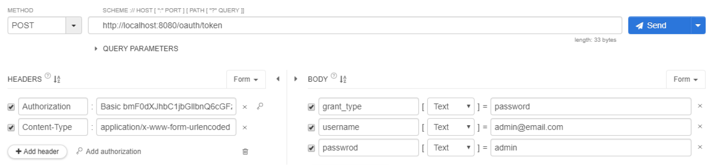
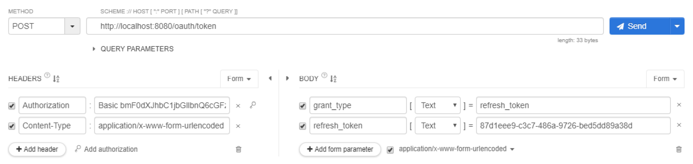

# 이벤트 API 점검

## ResourceServerConfig Authentication 수정
> GET /api/** 요청에 대해 `anonymous` 에게만 허용하겠다는 옵션을 `permitAll` 모두에게 허용하는 옵션으로 변경  
```java
@Override
public void configure(HttpSecurity http) throws Exception {
    http
        .anonymous()
            .and()
        .authorizeRequests()
            .mvcMatchers(HttpMethod.GET, "/api/**")
                .permitAll()
            .anyRequest().authenticated()
            .and()
        .exceptionHandling() // 인증이 잘못됐다던가 권한이 없는 경우 발생하는 예외중에 접근권한이 없는 것은
            .accessDeniedHandler(new OAuth2AccessDeniedHandler()); // OAuth2AccessDeniedHandler 를 사용함 403으로 status 응답을 내보내줌
}
```

## 토큰 발급 받기
- POST /oauth/token
- BASIC authentication(Authorization) 헤더
  - client Id(myApp) + client secret(pass)
- 요청 본문(Body) 폼
  - username: admin@email.com
  - password: admin
  - grant_type: password
  

  
## 토큰 갱신하기
- POST /oauth/token
- BASIC authentication 헤더
  - client Id(myApp) + client secret(pass)
- 요청 본문 폼
  - token: 처음에 발급받았던 refersh 토큰
  - grant_type: refresh_token


  
## 이벤트 목록 조회 API
- 로그인 안 했을때
  - 이벤트를 만드는 링크를 보여주지 않음
- 로그인 했을 때
  - 이벤트 생성 링크 제공
 
## 이벤트 조회
> EventController에서 현재 사용자 정보를 참조해야함  
- 로그인 했을 때
  - 이벤트 Manager인 경우에는 이벤트 수정 링크 제공