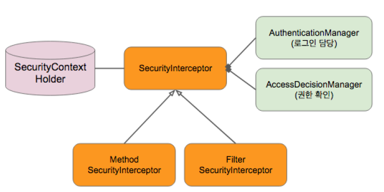

# 스프링 시큐리티 적용
## 스프링 시큐리티
- 웹 시큐리티 (**Filter** 기반 시큐리티): 웹 요청에 보안인증을 함
- 메서드 시큐리티: 웹과 상관없이 어떠한 메서드가 호출 됐을 때 인증 또는 권한을 확인해줌
- 이 둘 다 **Security** **Interceptor**를 사용합니다
- 리소스에 접근을 허용할 것이냐 말것이냐를 결정하는 로직이 들어있음

## 스프링 시큐리티 동작흐름  
  

  
----
1. 요청이 들어왔을 때 서블릿 필터가 가로챔
2. 웹 시큐리티 **Interceptor** 쪽으로 인증을 보냄
3. 요청에 스프링 시큐리티 필터를 적용해야하는지 판단
4. 스프링 시큐리티 필터에 들어오면 인증정보를 확인
5. **SecurityContextHolder**(기본 구현체는 **ThreadLocal**)에서 인증 정보를 꺼내려고 시도
6. 꺼내면 인증된 사용자가 이미 있는거고 없으면 인증을 한 적이 없는 것(현재 사용자가 없는 것)
7. 현재 사용자가 없다면 **AuthenticationManager**(로그인 담당)를 사용해서 로그인을 함
  - 인증이 되면 인증이 된 사용자는 SecurityContextHolder에 저장해둠  
  - **AuthenticationManager**은 두개의 서비스가 있음  
    1. `UserDetailsService`: 입력받은 **username**에 해당하는 **password** 를 읽어오는 서비스
    2. `PasswordEncoder`: 입력한 **password**가 사용자의 **password**와 일치하는지 검사하는 서비스
8. **AccessDecisionManager**에서 인증이 되면 요청한 리소스에 접근할 권한이 충분한가를 **User Role**로 확인

### ThreadLocal
- **JavaSDK**에 들어있는 한 **Thread** 내에서 공유하는 저장소  
- 어떤 **Application**에서 데이터를 넘겨주고 싶을 때 메세지 파라메터에 넘겨주지 않아도됨  
- 한 **Thread**에서 실행되는 메서드라면 **ThreadLocal**에 넣어놓고 다른 메서드에서 **Thread**로 꺼내서 쓰면됨  
- 데이터베이스랑 비슷함  

### AuthenticationManager
여러가지 방법으로 인증을 할 수 있음  
- **Basic Authentication**
  1. **username**과 **password**를 입력받음
  2. 인증 요청 헤더에서 **Authentication**, **basic**, **username** + **password** 을 모두 합쳐서 인코딩함
  3. `UserDetailsService` 인터페이스를 사용해서 입력받은 **username**에 해당하는 **password**를 읽어옴
  4. 읽어온 **password**와 사용자가 입력한 **password**가 매칭하는지 **password Encoder**로 검사
  5. 매칭이 되면 로그인이 된거고 **Authentication** 객체를 만들어서 **SecurityContextHolder**에 저장을 해둠

## 의존성 추가
스프링 시큐리티가 의존성에 들어오면 기본적으로 모든 요청이 인증이 필요하게됨  
```xml
<dependency>
    <groupId>org.springframework.security.oauth.boot</groupId>
    <artifactId>spring-security-oauth2-autoconfigure</artifactId>
    <version>2.1.2.RELEASE</version>
</dependency>
```

## AccountRepository 추가
**JpaRepository** 를 상속 받고 `findByEmail` 를 생성한다
```java
package me.freelife.rest.accounts;

import org.springframework.data.jpa.repository.JpaRepository;
import java.util.Optional;

public interface AccountRepository extends JpaRepository<Account, Long> {
    Optional<Account> findByEmail(String username);
}
```

## AccountService 구현
- **Account**를 스프링 시큐리티가 이해할 수 있는 타입인 **UserDetails**로 변환  
- 스프링 시큐리티가 제공하는 **User**라는 클래스를 사용해서 구현하면 전체 인터페이스를 다 구현하지 않아도 되어서 편리함  
- ROLE를 **GrantedAuthority** 변환해야됨  

```java
package me.freelife.rest.accounts;

import org.springframework.beans.factory.annotation.Autowired;
import org.springframework.security.core.GrantedAuthority;
import org.springframework.security.core.authority.SimpleGrantedAuthority;
import org.springframework.security.core.userdetails.User;
import org.springframework.security.core.userdetails.UserDetails;
import org.springframework.security.core.userdetails.UserDetailsService;
import org.springframework.security.core.userdetails.UsernameNotFoundException;
import org.springframework.stereotype.Service;

import java.util.Collection;
import java.util.Set;
import java.util.stream.Collectors;

@Service
public class AccountService implements UserDetailsService {

    @Autowired
    AccountRepository accountRepository;

    @Override
    public UserDetails loadUserByUsername(String username) throws UsernameNotFoundException {
        Account account = accountRepository.findByEmail(username)
                .orElseThrow(() -> new UsernameNotFoundException(username)); // account 객체가 없으 UsernameNotFoundException 에러를 던짐
        return new User(account.getEmail(), account.getPassword(), authorities(account.getRoles()));
    }

    private Collection<? extends GrantedAuthority> authorities(Set<AccountRole> roles) {
          return roles.stream()
                  .map(r -> new SimpleGrantedAuthority("ROLE_" + r.name()))
                  .collect(Collectors.toSet());
    }
}
```

## AccountServiceTest 코드 구현
```java
package me.freelife.rest.accounts;

import me.freelife.rest.common.TestDescription;
import org.junit.Test;
import org.junit.runner.RunWith;
import org.springframework.beans.factory.annotation.Autowired;
import org.springframework.boot.test.context.SpringBootTest;
import org.springframework.security.core.userdetails.UserDetails;
import org.springframework.security.core.userdetails.UserDetailsService;
import org.springframework.test.context.ActiveProfiles;
import org.springframework.test.context.junit4.SpringRunner;

import java.util.Set;

import static org.assertj.core.api.Assertions.assertThat;

@RunWith(SpringRunner.class)
@SpringBootTest
@ActiveProfiles("test")
public class AccountServiceTest {

    @Autowired
    AccountService accountService;

    @Autowired
    AccountRepository accountRepository;

    @Test
    @TestDescription("유저 인증 테스트")
    public void findByUsername() {
        // Given
        String password = "freelife";
        String username = "freelife@gmail.com";
        Account account = Account.builder()
                .email(username)
                .password(password)
                .roles(Set.of(AccountRole.ADMIN, AccountRole.USER))
                .build();
        this.accountRepository.save(account);

        // When
        UserDetailsService userDetailsService = (UserDetailsService) accountService;
        UserDetails userDetails = userDetailsService.loadUserByUsername(username);

        // Then
        assertThat(userDetails.getPassword()).isEqualTo(password);
    }
}
```

## 테스트 다 깨짐 (401 Unauthorized)
깨지는 이유는 스프링 부트가 제공하는 스프링 시큐리티 기본 설정 때문